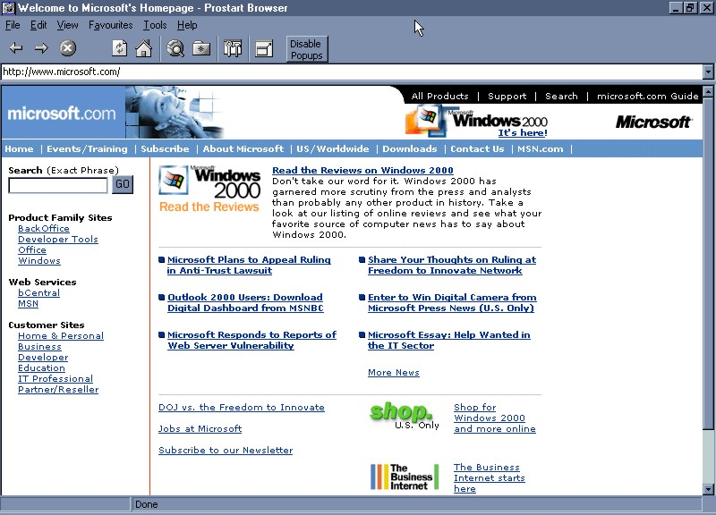



## Prostart WebBrowser 2 Beta

### Description

Finally, after a few months, i have released this amazing web browser. If you took a look at my first browser, then this is 10x better. This code teaches the following:

-how to show movie style credits

-how to make a splash screen

-How to make a fullscreen browser

-how to recieve mail using pop3 accounts

-how to send mail using SMTP

-how to load web pages from your hard drive

-shows the usage of progress bars

-how to open web documents source

-how to make auto-complete cbo's

-how to disable those annoying pop-up windows

-etc.

This browser is a really good learning experience for beginners and intermediats.

Please vote for me and send me your feedback.

Thanks
 
### More Info
 

             |
---                |---
**Submitted On**   |2000-04-16 18:20:04
**By**             |[Sulayman Khan](https://github.com/Planet-Source-Code/PSCIndex/blob/master/ByAuthor/sulayman-khan.md)
**Level**          |Intermediate
**User Rating**    |4.5 (36 globes from 8 users)
**Compatibility**  |VB 5\.0, VB 6\.0
**Category**       |[Internet/ HTML](https://github.com/Planet-Source-Code/PSCIndex/blob/master/ByCategory/internet-html__1-34.md)
**World**          |[Visual Basic](https://github.com/Planet-Source-Code/PSCIndex/blob/master/ByWorld/visual-basic.md)
**Archive File**   |[CODE\_UPLOAD48704162000\.zip](https://github.com/Planet-Source-Code/sulayman-khan-prostart-webbrowser-2-beta__1-7326/archive/master.zip)

